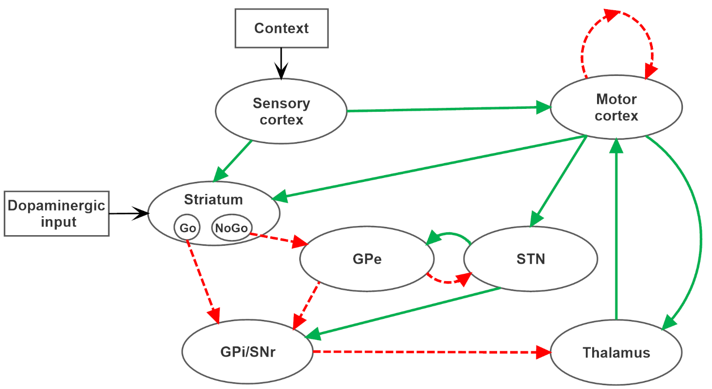

# Neurocomputational model of Basal Ganglia to simulate Reversal Learning Taks

This repository contains a model of basal ganglia able to simulate both deterministic and probabilistic reversal learning tasks.

## Basal Ganglia model

  

